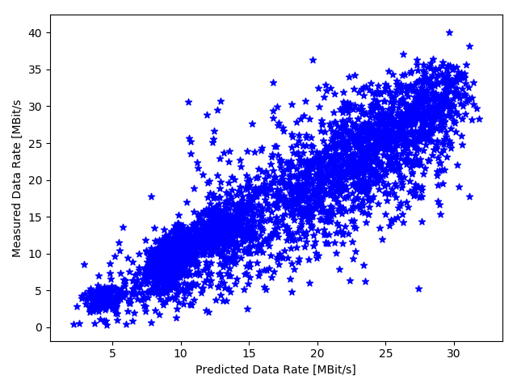

Examples
========

**This is a work in process section: Detailed comments are added step by step**

The following examples aim to provide comprehensible guides for applying specific data analysis methods with LIMITS. Each example is concluded by a typical result visualization. Please note that the presented code snippets focus on the core methods of the examples, the full source code can be accessed via the provided links.


## Related Publications

The considered examples are based on scientific analyses which have been carried out in previous publications. Users interested in a more detailed description about the involved challenges and methodological aspects are forwarded to:
- B.Sliwa, C. Wietfeld, [**Empirical Analysis of Client-based Network Quality Prediction in Vehicular Multi-MNO Networks**](https://arxiv.org/abs/1904.10177), In *2019 IEEE 90th Vehicular Technology Conference (VTC-Fall)*, 2019

## Overview

##### Performance Analysis
- [Performance Comparison of Prediction Models](#performance-comparison-of-prediction-models)
- [Model Reapplication and Error Visualization](#model-reapplication-and-error-visualization)
- [Artificial Neural Network Sweet Spot Determination](#artificial-neural-network-sweet-spot-determination)
- [Random Forest Sweet Spot Determination](#random-forest-sweet-spot-determination)
- [Model Convergence Analysis](#model-convergence-analysis)
- [Multi Regression](#multi-regression)


##### Feature Importance
- [Feature Correlation Analysis](#feature-correlation-analysis)
- [Artificial Neural Network Feature Importance](#artificial-neural-network-feature-importance)
- [Random Forest Feature Importance](#random-forest-feature-importance)
- [Support Vector Machine Feature Importance](#support-vector-machine-feature-importance)
- [Feature Reduction](#feature_reduction)

##### Model Visualization
- [Artificial Neural Network Visualization](#artificial-neural-network-visualization)
- [Random Forest Visualization](#random-forest-visualization)


## Performance Analysis

### Performance Comparison of Prediction Models

[[Complete source code of the example]](src/example_experiment.py)

In this example, we apply multiple supervised machine learning methods in order to forecast the achievable data rate based on measured passive network quality indicators which are provided in the data set *mnoA.csv*. Therefore, we set up an **experiment** which sequentially performs a **cross validation** of each prediction model.

```python
training = "../examples/mnoA.csv"
models = [ANN(), M5(), RandomForest(), SVM()]
e = Experiment(training, "example_experiment")
e.regression(models, 10)
```


```python
files = [e.path("cv_" + str(i) + ".csv") for i in range(len(models))]
fig, axs = plt.subplots(2,2)
fig.set_size_inches(8, 5)
xticks = [model.modelName for model in models]
ResultVisualizer().boxplots(files, "r2", xticks,  ylabel='R2', fig=fig, ax=axs[0][0], show=False)
ResultVisualizer().boxplots(files, "mae", xticks,  ylabel='MAE [MBit/s]', fig=fig, ax=axs[0][1], show=False)
ResultVisualizer().boxplots(files, "rmse", xticks,  ylabel='RMSE [MBit/s]', fig=fig, ax=axs[1][0], show=False)
ResultVisualizer().boxplots(files, "training", xticks,  ylabel='Training Time [s]', fig=fig, ax=axs[1][1], savePNG=e.path("example_experiment.png"))
```


### Model Reapplication and Error Visualization

[[Complete source code of the example]](src/example_model_reapplication.py)

For each cross validation run, a prediction model is learned and a *C++* implementation of the trained model is exported. The **CodeEvaluator** module then compiles a dummy version of the model and replays all measurements contained in the *test set* of the current fold.

```python
ce = CodeEvaluator()
R, C = ce.crossValidation(model, training, attributes, e.tmp())
ResultVisualizer().scatter([e.tmp()+"predictions_"+str(i)+".csv" for i in range(10)], "prediction", "label", xlabel='Predicted Data Rate [MBit/s]', ylabel='Measured Data Rate [MBit/s', savePNG=e.path("example_model_reapplication.png"))
```




### Artificial Neural Network Sweet Spot Determination

[[Complete source code of the example]](src/example_ann_sweet_spot.py)


### Random Forest Sweet Spot Determination

[[Complete source code of the example]](src/example_rf_sweet_spot.py)


### Model Convergence Analysis

[[Complete source code of the example]](src/example_model_convergence.py)

```python
e = ConvergenceAnalysis("example_model_convergence")
e.run("../examples/mnoA.csv", RandomForest(), 100, e.resultFolder+"convergence_rf.txt")
ResultVisualizer().errorbars([e.resultFolder+"convergence_rf.txt"], "rmse", xlabel='Number of Training Samples', ylabel='RMSE', savePNG=e.resultFolder+'example_model_convergence.png')
```


### Multi Regression

[[Complete source code of the example]](src/example_multi_regression.py)

```python
m = MultiExperiment("example_multi_regression")
m.run(model, [t0, t1, t2])
```

```python
resultFolder = "results/example_multi_regression/"
files = [resultFolder + x + ".csv" for x in ["mae", "rmse", "r2"]]
ResultVisualizer().colormaps(1, 3, files, ["MAE", "RMSE", "R2"], **{"cmap":"Blues", "xlabel":"Test", "ylabel":"Training"})
```


## Feature Analysis


### Feature Correlation Analysis

[[Complete source code of the example]](src/example_correlation.py)

```python
resultFolder = "results/example_correlation/"
resultFile = resultFolder + "corr.csv"

csv.computeCorrelationMatrix(resultFile)
ResultVisualizer().colorMap(resultFile, savePNG=resultFolder+'example_correlation.png')
```


### Artificial Neural Network Feature Feature Importance

[[Complete source code of the example]](src/example_ann_feature_importance.py)


### Random Forest Feature Importance

[[Complete source code of the example]](src/example_rf_mdi.py)

```python
M = CSV(e.path("features_0.csv")).toMatrix()
M.normalizeRows()
M.sortByMean()
M.save(e.path("rf_features.csv"))
```

```python
ResultVisualizer().barchart(e.path("rf_features.csv"), xlabel="Feature", ylabel="Relative Feature Importance", savePNG=e.path(e.id+".png"))
```


### Support Vector Machine Feature Importance

[[Complete source code of the example]](src/example_svm_feature_importance.py)


### Feature Reduction

[[Complete source code of the example]](src/example_feature_reduction.py)

```python
M = CSV(e.path("features_0.csv")).toMatrix()
M.normalizeRows()
M.sortByMean()
```

```python
for i in range(len(M.header)-1):
	key = M.header[-1]
	M.header = M.header[0:-1]
	csv.removeColumnWithKey(key)
	csv.save(subset)

	e = Experiment(subset, "example_feature_reduction")
	e.regression([model], 10)
```


## Model Visualization

### Artificial Neural Network Visualization

[[Complete source code of the example]](src/example_ann_visualization.py)

```python
e = Experiment(training, "example_ann_visualization")
e.regression([model], 10)

CodeGenerator().export(training, model, e.path("ann.cpp"))
model.exportEps(e.path("ann_vis.eps"))
```


### Random Forest Visualization

[[Complete source code of the example]](src/example_rf_visualization.py)

```python
training = "../examples/vehicleClassification.csv"
model = RandomForest()
model.config.depth = 7

e = Experiment(training, "example_rf")
e.classification([model], 10)
```

```python
RandomForest_WEKA(model).initModel(data, attributes)
model.exportEps(model.depth+1, 10, 10, len(attributes)-1)
```


